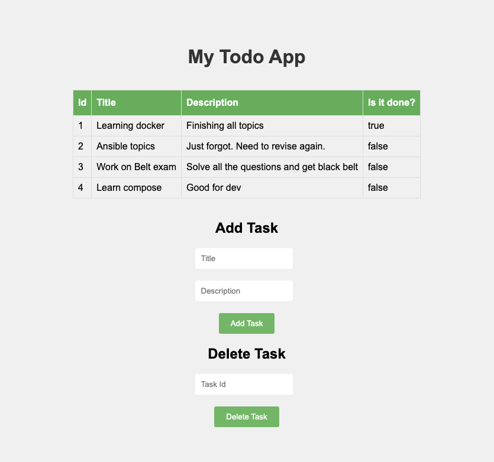

# To-Do List API

## Project Purpose

The purpose of this project is to provide a RESTful API for a to-do list application. This API allows users to manage their to-do tasks by providing functionalities to add, retrieve, update, and delete tasks. The API is built using Flask and the data is stored in a MySQL database.



## Tech Stack

- **Flask**: Flask is a lightweight WSGI web application framework. It is designed to make getting started quick and easy, with the ability to scale up to complex applications.

- **MySQL**: MySQL is a freely available open-source Relational Database Management System (RDBMS) that uses Structured Query Language (SQL). SQL is the most popular language for adding, accessing and managing content in a database.

## API Documentation

Below is the list of endpoints for the To-Do List API:

| HTTP Method | Endpoint | Description | Request Body | Example Response |
|-------------|----------|-------------|--------------|------------------|
| GET | /todos | Retrieves all tasks | N/A | `[{"description":"Finishing all topics","is_done":true,"task_id":1,"title":"Learning docker"}]` |
| GET | /todos/<int:task_id> | Retrieves a task by ID | N/A | `{"description":"Finishing all topics","is_done":true,"task_id":1,"title":"Learning docker"}` |
| POST | /todos | Creates a new task | `{"title": "<title>", "description": "<description>"}` | `{"newly added task":{"description":"<description>","is_done":false,"task_id":2,"title":"<title>"}}` |
| PUT | /todos/<int:task_id> | Updates an existing task | `{"title": "<title>", "description": "<description>", "is_done": <bool>}` | `{"updated task":{"description":"<description>","is_done":<bool>,"task_id":2,"title":"<title>"}}` |
| DELETE | /todos/<int:task_id> | Deletes a task | N/A | `{"result":true}` |

Here, assume actual will come for each filed `<int:task_id>`, `<title>`, `<description>`, and `<bool>`. `<bool>` should be 0 for not done, and 1 for done.

This project can serve as a backend for any frontend service that needs to-do list functionality. Please make sure to update the `app.config` with your database credentials and other details.

Also, change api endpoint in html file.

# Running the To-Do List API with Docker

The project uses Docker to create a containerized version of the application, providing an easy way to ensure that the application runs in the same way across different platforms.

## Docker Prerequisites

- Install Docker Desktop on your local machine. Installation instructions can be found on the Docker's [official site](https://www.docker.com/products/docker-desktop).
- Verify the Docker installation by running `docker --version` in the command line.

## Steps to Build and Run the Docker Container

1. Navigate to the root folder of the project where the Dockerfile is located.

2. Build the Docker image by running the following command:

   ```bash
   docker build -t todo-api:latest .
   ```
   This command builds a Docker image from the Dockerfile and tags it as "todo-api:latest". The `-t` option is used to name and optionally tag the image in the 'name:tag' format. The `.` at the end of the command is the context, which points to the current directory.

3. After the Docker image has been built, you can run the Docker container with the following command:

   ```bash
   docker run -p 80:80 todo-api:latest
   ```
   The `-p` option is used to map the port from the Docker container to your host machine. In this case, the application inside the Docker container which is running on port 80 is accessible via port 80 on your host machine.

Your Dockerized application should now be running at http://localhost.

## Troubleshooting Docker

- To view the running Docker containers, use the command:

  ```bash
  docker ps
  ```

- If you want to stop a running Docker container, use the command:

  ```bash
  docker stop <container_id>
  ```
  Replace `<container_id>` with your actual running docker container id.

- To remove a Docker image, use the command:

  ```bash
  docker rmi <image_id>
  ```
  Replace `<image_id>` with your actual Docker image id.

Please remember to replace `<container_id>` and `<image_id>` with your actual Docker container id and Docker image id.


# Running the To-Do List API with Docker Compose

The project also includes a Docker Compose file which allows you to manage and run multi-container Docker applications. Docker Compose uses a YAML file (`docker-compose.yml`) to configure the application's services.

## Docker Compose Prerequisites

- Docker Compose is included in Docker Desktop. If you haven't done already, install Docker Desktop on your local machine. Installation instructions can be found on Docker's [official site](https://www.docker.com/products/docker-desktop).

- Verify the Docker Compose installation by running `docker-compose --version` in the command line.

## Steps to Build and Run the Docker Containers with Docker Compose

1. Navigate to the root folder of the project where the `docker-compose.yml` file is located.

2. Start the application by running the following command:

   ```bash
   docker-compose up -d
   ```
   This command pulls the necessary images, builds the services declared in the `docker-compose.yml` file, and starts the services in detached mode (`-d` option).

Your Dockerized application should now be running at http://localhost.

To check the status of your services, run:

   ```bash
   docker-compose ps
   ```

## Stopping the Application

To stop the services running in the background, run:

   ```bash
   docker-compose down
   ```

## Rebuilding the Application

If you make changes to the application code or Dockerfile and need to rebuild your Docker image, you can use the following command:

   ```bash
   docker-compose up -d --build
   ```
This command will rebuild the image and restart the services.

## Troubleshooting Docker Compose

- To view the logs for your services, you can use the `docker-compose logs` command:

  ```bash
  docker-compose logs
  ```
  
- To execute commands inside the container, use the `docker-compose exec` command:

  ```bash
  docker-compose exec <service_name> <command>
  ```
  Replace `<service_name>` with your actual service name (like `myapp`) and `<command>` with your actual command.

Note: It's good practice to replace `<service_name>` and `<command>` with your actual service name and the command you want to run inside the Docker container.